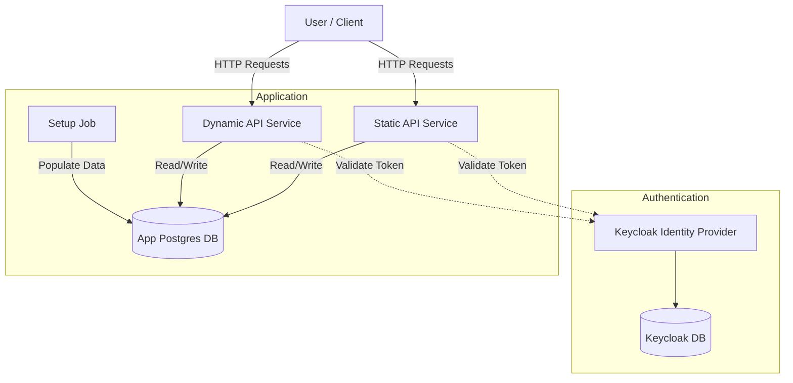

# Ecostars Kubernetes Deployment

This directory contains the Helm chart to deploy the Ecostars Mock Server stack on Kubernetes.

## Architecture

The deployment consists of the following components:



## Prerequisites

- Kubernetes Cluster (Minikube, Kind, Docker Desktop, or Cloud Provider).
- [Helm](https://helm.sh/docs/intro/install/) installed.
- **Docker Images**: The chart uses `ecostars/static-api:latest` and `ecostars/dynamic-api:latest`. If running locally (Kind/Minikube), ensure you build and load these images:

```bash
# Build images
docker build -t ecostars/static-api:latest .
docker build -t ecostars/dynamic-api:latest .

# Load into Kind (example)
kind load docker-image ecostars/static-api:latest
kind load docker-image ecostars/dynamic-api:latest
```

## Installation

1. **Deploy the chart**:

```bash
helm install ecostars ./k8s/ecostars
```

2. **Verify Pods are running**:

```bash
kubectl get pods
```

3. **Port Forwarding** (for local access):

```bash
# Forward Keycloak
kubectl port-forward svc/ecostars-keycloak 8080:8080 &

# Forward Static API
kubectl port-forward svc/ecostars-static-api 8081:8081 &

# Forward Dynamic API
kubectl port-forward svc/ecostars-dynamic-api 8082:8082 &
```

## Configuration

You can customize the deployment by creating a `my-values.yaml` file or editing `k8s/ecostars/values.yaml`.

Key configuration parameters:

| Parameter | Description | Default |
|-----------|-------------|---------|
| `postgres.auth.password` | Database password | `postgres` |
| `keycloak.auth.adminPassword` | Keycloak Admin Password | `admin` |
| `keycloakDb.auth.password` | Keycloak DB Password | `password` |

To install with custom values:

```bash
helm install ecostars ./k8s/ecostars -f my-values.yaml
```

## Local Access from Browser

Enabling Ingress in Helm is the first step, but for it to work from your browser, you need to complete two additional steps:

### 1. Ingress Controller
You must have an Ingress Controller (like NGINX) installed in your cluster. If you are using **Kind**, you might need to install it with the following command (specific for local clusters):

```bash
kubectl apply -f https://raw.githubusercontent.com/kubernetes/ingress-nginx/main/deploy/static/provider/kind/deploy.yaml
```

*Note: For the ports to be reachable on localhost, your Kind cluster must have been created with extraPortMappings for 80/443.*

### 2. Local DNS (nip.io)

Instead of editing `/etc/hosts`, we use **[nip.io](https://nip.io/)**. This is a wildcard DNS service that maps any IP address in a hostname back to that IP.

The default configuration uses `127.0.0.1.nip.io`. This means the following URLs will resolve to your local machine automatically:

- Keycloak: [http://auth.127.0.0.1.nip.io](http://auth.127.0.0.1.nip.io)
- Static API: [http://static.127.0.0.1.nip.io/hotels](http://static.127.0.0.1.nip.io/hotels)
- Dynamic API: [http://dynamic.127.0.0.1.nip.io/subscriptions/subscribe](http://dynamic.127.0.0.1.nip.io/subscriptions/subscribe)

*No `/etc/hosts` modification is required if you use these URLs!*

## Setup Job

A Kubernetes Job (`ecostars-setup`) runs automatically after installation to populate the database with mock data.
